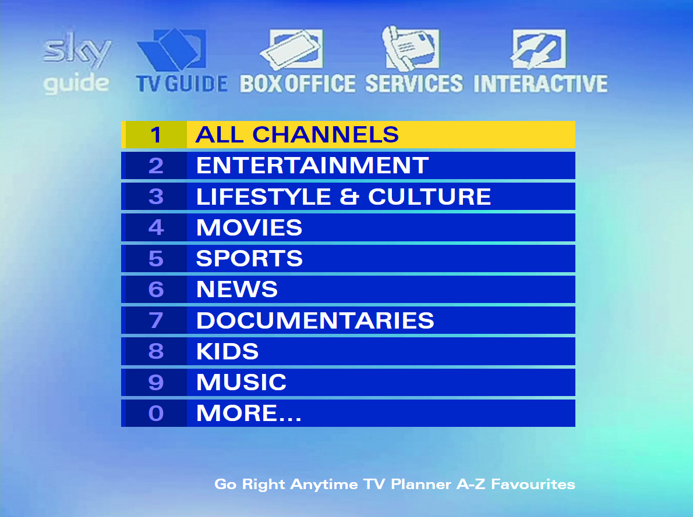

# Sky Web EPG | Current Version: **`5.11xm`**
A recreation of the classic EPG on the Sky Digiboxes and legacy Sky+ from 2005-2010. While we are only planning on basing this from the 
latest Sky+ EPG version `5.08.6` (some elements will be reused from `3.8.8`), we have plans to make the 1998 and 2001 Digibox EPG menus too.

## What channel listing is this based on?
This is based on any real life channel listing provided by Sky. This is based on our web-based channel listing, the **OLDDIGIBOX NETWORK.**

# Sky Web EPG License
## Copyright © 2020 OldDigibox

OldDigibox is in no way affiliated with Sky plc or its subsidiaries.  

"Sky" and the Sky trademarks, including "Digibox" and "Sky+" are owned by Sky plc and Sky International AG.

You may, free of charge, clone, modify and/or re-distribute "Sky Web EPG" but only for free. "Sky Web EPG" contains tracks published by SATV.
© SATV

"Sky Web EPG" contains tracks from the albums "Sky Web EPG" and "Sky Web EPG 2" published by Bryson Records Web Publishing Ltd.